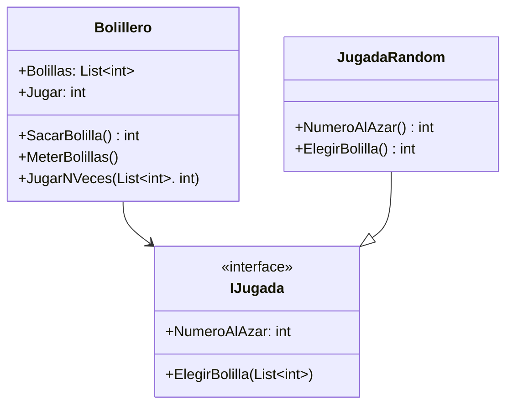

## Documentacion

```mermaid
classDiagram
    class Bolillero{
        +Bolillas: List~int~
        +Jugar: int
        +SacarBolilla() int
        +MeterBolillas() 
        +JugarNVeces(List~int~. int) 
    }
    class IJugada{
        <<interface>>
        +NumeroAlAzar: int
        +ElegirBolilla(List~int~)
    }
    class JugadaRandom{
        +NumeroAlAzar() int
        +ElegirBolilla() int
    }
    Bolillero --> IJugada
    JugadaRandom --|> IJugada
    
```

